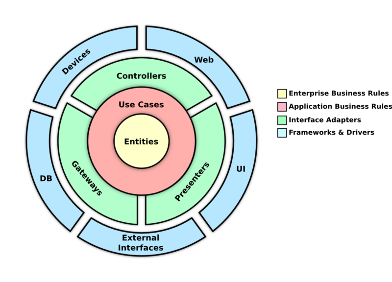

# 05-nest-clean

aplicação criada com os principios da clean architeture,
é um forum de estudantes e professores, onde voce pode postar perguntas e responder a perguntas etc.

## Tecnologias Utilizadas

- **NestJS**: Framework para construir aplicações back-end escaláveis e eficientes em Node.js.  
- **bcryptjs**: Biblioteca para criptografar senhas.  
- **Zod**: Biblioteca de validação.  
- **REST Client**: Extensão e ferramenta de envio de requisições HTTP.  
- **Passport**: Middleware de autenticação para Node.js.  
- **JWT**: Utilizado para criar tokens de segurança.  
- **AuthGuard**: Componente responsável por proteger rotas, garantindo que apenas usuários autenticados possam acessá-las.  
- **Vitest**: Ferramenta de testes.  
- **SWC**: Utilizado para substituir o TypeScript Compiler.  
- **dotenv**: Biblioteca para carregar variáveis de ambiente a partir de um arquivo `.env`.  
- **Supertest**: Biblioteca que faz requisições HTTP (como GET, POST, PUT, DELETE) para os endpoints da sua API.  
- **Clean Architecture**: Arquitetura limpa aplicada ao projeto.  
- **Faker**: Biblioteca para criar dados fictícios para testes.  
- **Day.js**: Biblioteca para manipulação de datas de forma simples e performática. 